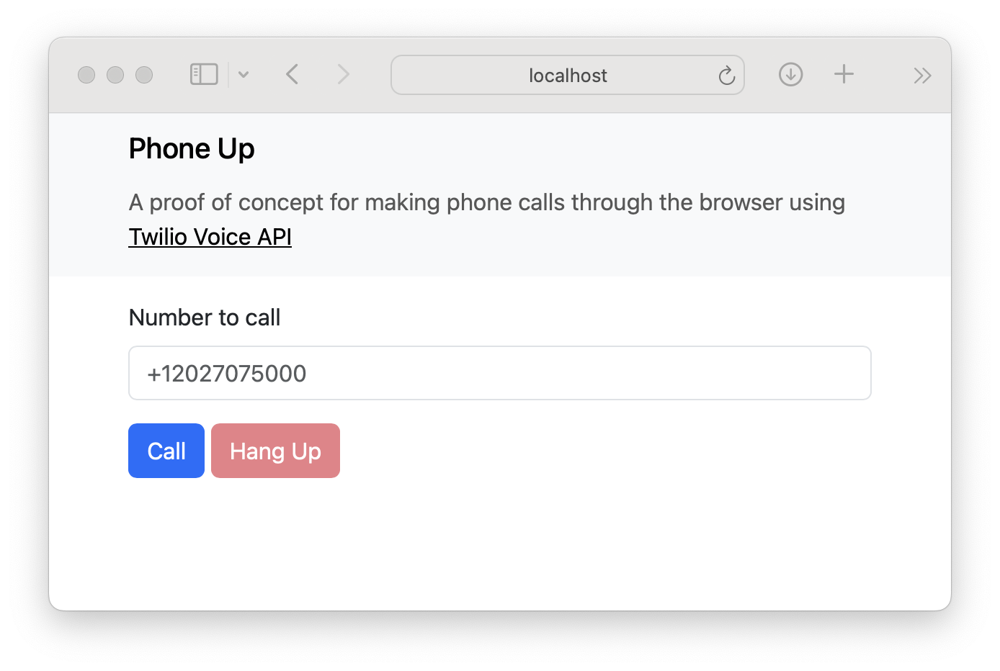

# Phone Up



A proof of concept for making phone calls through the browser using [Twilio Voice API](https://www.twilio.com/docs/voice).

## Stack

- [Ruby 3.3.0](https://www.ruby-lang.org/en/news/2023/12/25/ruby-3-3-0-released/)
- [Ruby on Rails 7.1.3](https://rubyonrails.org/2024/1/16/Rails-7-1-3-has-been-released)
- [PostgreSQL 16.1](https://www.postgresql.org/docs/release/16.1/)
- [Twilio Voice API](https://www.twilio.com/docs/voice)
- [Docker](https://docs.docker.com/get-docker/)
- [ngrok](https://ngrok.com/docs/getting-started/)

## Environment variables

- `TWILIO_ACCOUNT_SID`: Account SID of your own Twilio account; it starts with `AC`.
- `TWILIO_API_KEY` and `TWILIO_API_SECRET`: SID and secret key of [an API key to access the Twilio API](https://www.twilio.com/docs/iam/api-keys/api-key); SID starts with `SK`.
- `TWILIO_CALLER_ID`: your Twilio phone number written in [E.164 format](https://www.twilio.com/docs/glossary/what-e164); e.g. `+12027075000`.
- `TWILIO_TWIML_APP_SID`: SID of [a TwiML application](https://support.twilio.com/hc/en-us/articles/223180928-How-Do-I-Create-a-TwiML-App); it start with `AP`; the Request URL for Voice Configuration must point to the [`/api/v1/voice`](app/controllers/api/v1/voices_controller.rb) endpoint of this project; run this project locally and expose it publicly using [ngrok](https://ngrok.com) in order to get a publicly accessible URL to that endpoint; e.g. `https://<random-identifier>.ngrok-free.app/api/v1/voice`. 

## Run

1. Ensure [Docker](https://docs.docker.com/get-docker/) is running.
   ```shell
   docker version
   ```
2. Copy [`.env.example`](.env.example) to `.env` and edit the [environment variables](#environment-variables).
   ```shell
   cp .env.example .env
   ```
3. Run the application container.
   ```shell
   docker compose up
   ```
4. Expose the project publicly.
   ```shell
   ngrok http 3000
   ```
5. Browse to http://localhost:3000/.
   ```shell
   open http://localhost:3000/
   ```
5. Stop the application container.
   ```shell
   docker compose down
   ```
